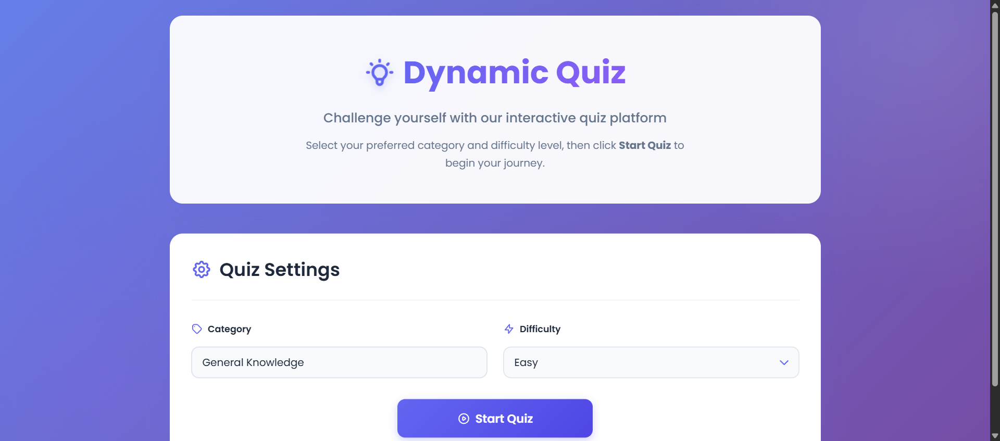
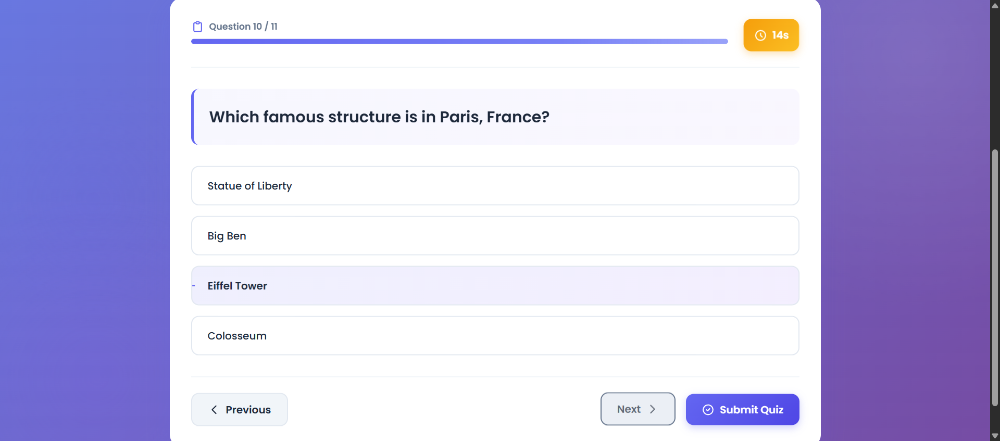
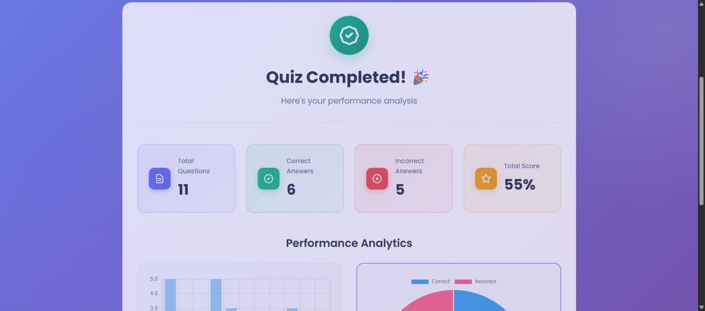

# 📘 Dynamic Quiz Application with Timer & Result Analysis  
### Frontend: PHP + HTML + CSS + JavaScript  
### Automation Testing: Selenium WebDriver (Java + Maven)

## 🌟 Project Preview

### 🖼️ Landing Page

### 🖼️ Question Page

### 🖼️ Result Analysis Page

---

## 📌 Project Overview
This project is a **Dynamic Quiz Application** that allows users to:
- Select quiz **category** and **difficulty**
- View questions one at a time
- Answer within a **countdown timer**
- Auto-submit on timeout
- Get a detailed **result analysis**
- View charts for performance using **Chart.js**
- Experience a fully **responsive UI**

Additionally, Selenium WebDriver is used to **automate the testing** of the entire quiz flow.

---

## 🗂️ Folder Structure

quiz-project/
│
├── frontend/
│ ├── index.php
│ ├── data/
│ │ └── questions.js
│ ├── assets/
│ │ ├── css/
│ │ │ └── styles.css
│ │ └── js/
│ │ └── quiz.js
│ └── (Chart.js via CDN)
│
└── automation/
├── pom.xml
├── src/
│ └── test/
│ └── java/
│ └── com/quiztest/
│ └── QuizAutomationTest.java
│
└── resources/
├── screenshots/
└── logs/
├── selenium_run.log
├── browser_console.log
└── performance.log

---

# 🚀 Running the Frontend

### Step 1 — Go to your project folder:

cd quiz-project
### Step 2 — Start the PHP development server:

php -S localhost:8000 -t frontend

### Step 3 — Open in your browser:
👉 http://localhost:8000  
or  
👉 http://localhost:8000/index.php  

Your quiz application will load and run completely.

---

# 🤖 Running Selenium Automation Tests

### Step 1:
cd quiz-project/automation

### Step 2:
mvn test

### During test execution, Selenium will:
- Open the quiz website  
- Click **Start Quiz**  
- Navigate through all questions  
- Select options automatically  
- Submit the quiz  
- Capture screenshots  
- Save browser console logs  
- Save performance logs  
- Create a full automation event log  

### Output Files Will Be Saved Here:
automation/resources/screenshots/
automation/resources/logs/

---

# 📊 Result Analysis (Chart.js)

Two charts are displayed on the result page:
- **Bar Chart** → Time spent per question  
- **Pie Chart** → Correct vs incorrect answers  

Chart.js is loaded through CDN

Screen Recording Requirements

A screen recording of Selenium automation must be included.

Your video should show:

Opening the quiz URL

Running the automated test

Auto-answering questions

Quiz submission

Result analysis

Screenshots and logs being generated

Upload the video to Google Drive and provide a shareable link.

Video : https://drive.google.com/file/d/12BHH3Kqj3oDGXDaRmdmv5oabB96-1yog/view?usp=sharing

Github repo link: https://github.com/himasnhu018/Frugal_Testing-_SE

Testing Scenarios Covered
Test Case	Status
Verify landing page	✔ Automated
Start quiz	✔ Automated
Navigate through questions	✔ Automated
Select answers	✔ Automated
Submit quiz	✔ Automated
Verify result analysis	✔ Automated
Capture screenshots	✔ Automated
Save Selenium logs	✔ Automated

Submission Checklist

✔ Google Drive link of screen recording
✔ Test report containing screenshots + logs
✔ GitHub Repository link of:

Frontend code

Selenium automation code

README.md

Logs & screenshots

Author

Himanshu Kumar Gupta
Computer Science & Engineering (AIDS)
Parul Institute of Engineering & Technology

---
